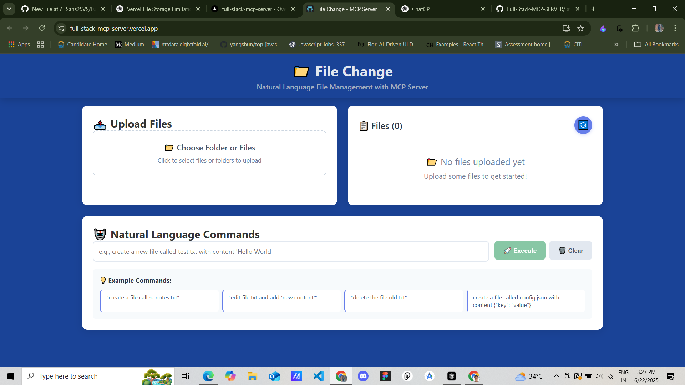

# 📁 File Change - Natural Language File Management System

File Change is a full-stack application that allows you to manage files and folders using natural language commands. It features a React frontend and a Node.js backend powered by Express, with OpenAI for command processing and Google Cloud Storage for persistent file storage.
[Hosted URL] - (https://full-stack-mcp-server.vercel.app/)

## ✨ Features

- **Natural Language Commands**: Create, edit, and delete files using plain English.
- **File & Folder Uploads**: Easily upload files or entire folders.
- **Cloud Storage**: Files are securely stored in Google Cloud Storage.
- **File Viewer**: View the content of your text-based files directly in the app.
- **Modern UI**: A clean, responsive, and intuitive user interface built with React.
- **Real-time Feedback**: Loading indicators and toast notifications for all operations.
- **Extensible**: Backend architecture is modular and easy to extend.

## 🚀 Live Demo

[Link to your deployed application]

## 🛠️ Tech Stack

- **Frontend**: React.js, CSS
- **Backend**: Node.js, Express.js
- **File Storage**: Google Cloud Storage
- **AI**: OpenAI API
- **File Uploads**: Multer
- **Deployment**: Vercel (or any other platform)

## 📂 Project Structure

The project is a monorepo with two main directories:

- `/client`: Contains the React frontend application.
- `/server`: Contains the Node.js backend server.

Each directory has its own `package.json` and dependencies.

---

## 🔧 Setup and Installation

### Prerequisites

- [Node.js](https://nodejs.org/) (v14 or later)
- [npm](https://www.npmjs.com/)
- A [Google Cloud Platform](https://cloud.google.com/) account with a project and a Storage bucket.
- An [OpenAI API key](https://platform.openai.com/signup).

### 1. Clone the repository

```bash
gh repo clone Sans25VS/Full-Stack-MCP-SERVER
cd Full-Stack-MCP-SERVER
```

### 2. Setup the Backend (`/server`)

1.  Navigate to the server directory:
    ```bash
    cd server
    ```

2.  Install dependencies:
    ```bash
    npm install
    ```

3.  Create a `.env` file in the `/server` directory and add the following environment variables. See `GOOGLE_CLOUD_SETUP.md` for more details on setting up Google Cloud.

    ```env
    # Server Configuration
    PORT=3001
    NODE_ENV=development

    # OpenAI Configuration
    OPENAI_API_KEY=your_openai_api_key_here

    # Google Cloud Storage Configuration
    GOOGLE_CLOUD_PROJECT_ID=your_gcp_project_id
    GOOGLE_CLOUD_BUCKET_NAME=your_gcs_bucket_name
    # For Vercel/production, use GOOGLE_CLOUD_CREDENTIALS instead of the key file
    GOOGLE_CLOUD_CREDENTIALS='{"type": "service_account", ...}'
    # For local development, you can use a key file
    # GOOGLE_CLOUD_KEY_FILE=path/to/your/service-account-key.json

    # Uploads Directory (for local development fallback)
    UPLOADS_DIR=./uploads
    ```

4.  Start the development server:
    ```bash
    npm run dev
    ```
    The server will be running on `http://localhost:3001`.

### 3. Setup the Frontend (`/client`)

1.  Navigate to the client directory from the root:
    ```bash
    cd client
    ```

2.  Install dependencies:
    ```bash
    npm install
    ```

3.  The frontend is configured to connect to the deployed backend by default. For local development, you can change the `API_BASE_URL` in `client/src/config.js` to `http://localhost:3001`.

4.  Start the development server:
    ```bash
    npm start
    ```
    The client will be running on `http://localhost:3000`.

## 📜 Available Scripts

### Server (`/server`)

- `npm start`: Starts the server in production mode.
- `npm run dev`: Starts the server in development mode with `nodemon`.

### Client (`/client`)

- `npm start`: Runs the app in development mode.
- `npm run build`: Builds the app for production.
- `npm test`: Runs the test suite.

## 🔌 API Endpoints

The server exposes the following REST API endpoints:

| Method | Endpoint             | Description                                   |
| ------ | -------------------- | --------------------------------------------- |
| `POST` | `/upload`            | Uploads one or more files.                    |
| `GET`  | `/files`             | Retrieves a list of all files.                |
| `GET`  | `/files/:filename`   | Retrieves the content of a specific file.     |
| `POST` | `/command`           | Processes a natural language command.         |
| `GET`  | `/health`            | Health check endpoint.                        |

## 🖼️ Screenshots



## 📄 License

This project is licensed under the MIT License. See the `LICENSE` file for details. 